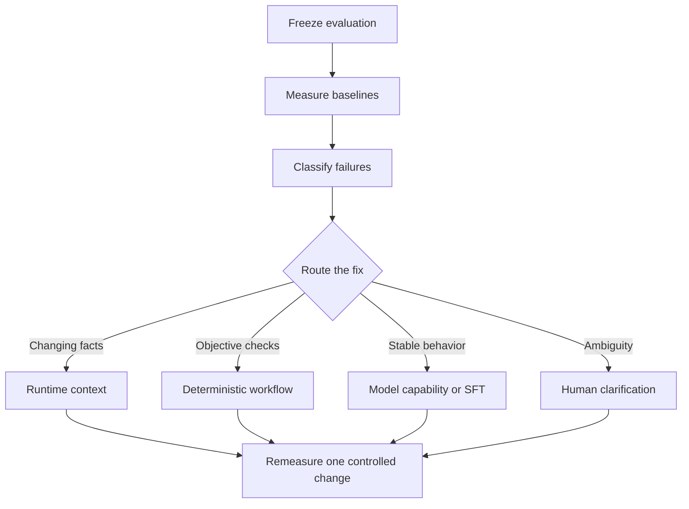

# DomainAdapt

DomainAdapt is a reference implementation for answering a practical AI architecture question:

> When should a domain-specific failure be solved with runtime context,
> deterministic workflow logic, a stronger model, or model fine-tuning?

V1 uses financial Text-to-SQL because SQL can be executed and compared objectively. The methodology is domain-agnostic and transfers to private APIs, CAD and engineering tools, healthcare workflows, finance operations, support automation, and other specialized systems.

## V1 conclusion

The strongest measured system was **GPT-5.6 Sol with engineered context**:

- **17/24 correct (70.8%)**;
- **24/24 executable**;
- 36,316 total tokens; and
- 3.111-second median latency.

The central finding is more useful than the winning score:

- context engineering improved both the small model and frontier model;
- GPT-5.6 Sol added only one correct answer over GPT-5.2 under the same context;
- SFT v1 did not improve the small model's accuracy; and
- the strongest system's remaining failures were semantic rather than
  syntactic.

Fine-tuning was therefore **not** the best production investment in V1. If higher accuracy is required, the next justified experiment is a bounded validation and one-repair workflow.

## Benchmark summary

| System | Correct | Executable | Total tokens | Median latency |
|---|---:|---:|---:|---:|
| GPT-5.2 + minimal context | 11/24 | 24/24 | 9,081 | 1.827 s |
| GPT-5.2 + engineered context | 16/24 | 24/24 | 32,117 | 1.523 s |
| **GPT-5.6 Sol + engineered context** | **17/24** | **24/24** | **36,316** | **3.111 s** |
| Ministral-3B + minimal context | 1/24 | 10/24 | 8,254 | 0.940 s |
| Ministral-3B + engineered context | 7/24 | 17/24 | 34,241 | 1.079 s |
| SFT v1 + engineered context | 7/24 | 16/24 | 34,306 | 1.237 s |

See [the complete benchmark interpretation](docs/benchmark_summary.md) for failure categories, intervention effects, caveats, and the final V1 decision.

## Method



The project follows four rules:

1. **Freeze evaluation before optimization.**
2. **Separate executability from semantic correctness.**
3. **Change one major variable per experiment.**
4. **Put changing facts in context, objective rules in code, stable behavior in
   weights, and genuine ambiguity in front of a human.**

## Notebook journey

| Milestone | Notebook | Purpose |
|---:|---|---|
| 0 | [`00_project_orientation.ipynb`](notebooks/00_project_orientation.ipynb) | Understand FINCH/BIRD and the experiment |
| 1 | [`01_dataset_and_eval.ipynb`](notebooks/01_dataset_and_eval.ipynb) | Build the leakage-safe splits and deterministic evaluator |
| 2 | [`02_frontier_baseline.ipynb`](notebooks/02_frontier_baseline.ipynb) | Establish the GPT-5.2 minimal-context baseline |
| 3 | [`03_failure_analysis.ipynb`](notebooks/03_failure_analysis.ipynb) | Build an evidence-backed failure taxonomy |
| 4 | [`04_slm_baseline.ipynb`](notebooks/04_slm_baseline.ipynb) | Measure the unmodified Ministral-3B gap |
| 5 | [`05_context_engineering.ipynb`](notebooks/05_context_engineering.ipynb) | Test relationships, meanings, verified values, and guardrails |
| 6 | [`06_adaptation_hypothesis.ipynb`](notebooks/06_adaptation_hypothesis.ipynb) | Decide whether residual behavior is suitable for adaptation |
| 7 | [`07_training_data.ipynb`](notebooks/07_training_data.ipynb) | Design and audit leakage-safe SFT data |
| 8 | [`08_fine_tuning.ipynb`](notebooks/08_fine_tuning.ipynb) | Create and deploy the Ministral-3B SFT experiment |
| 9 | [`09_post_sft_evaluation.ipynb`](notebooks/09_post_sft_evaluation.ipynb) | Measure incremental SFT value |
| 9b | [`09b_frontier_context_evaluation.ipynb`](notebooks/09b_frontier_context_evaluation.ipynb) | Apply the selected context to GPT-5.2 |
| 9c | [`09c_advanced_model_evaluation.ipynb`](notebooks/09c_advanced_model_evaluation.ipynb) | Compare GPT-5.6 Sol with GPT-5.2 under fixed context |
| 10 | Documentation below | Synthesize conclusions and the reusable playbook |

Milestone 10 is documentation-first because the experimental evidence already
exists. Another notebook would duplicate the deterministic summaries in
Milestones 9, 9b, and 9c.

## Reusable documentation

- [V1 benchmark summary](docs/benchmark_summary.md)
- [Architecture and component boundaries](docs/architecture.md)
- [Domain-adaptation decision framework](docs/domain_adaptation_decision_framework.md)
- [Adaptation-hypothesis playbook](docs/adaptation_hypothesis_playbook.md)
- [Training-data design playbook](docs/training_data_design_playbook.md)
- [Product requirements](PRD.md)

## Repository structure

```text
domain-adapt/
configs/        # versioned experiment and evaluation contracts
data/           # local data instructions; downloaded assets are ignored
docs/           # reusable methods, architecture, and final evidence
notebooks/      # milestone-by-milestone learning journey
src/            # stable evaluation and model-invocation helpers
tests/          # deterministic contract and evaluator tests
```

## Setup

Requirements:

- Python 3.12 or newer;
- [`uv`](https://docs.astral.sh/uv/);
- Azure CLI for Entra authentication; and
- access to the Azure/Foundry deployments used by the model notebooks.

Install and test:

```powershell
uv sync
uv run pytest -q
```

Follow [`data/README.md`](data/README.md) to place the local FINCH/BIRD assets.
The repository intentionally does not redistribute the downloaded datasets.

Model experiments read deployment information from a local `.env` file. Keep
credentials and endpoints out of Git. The notebooks use variables such as:

```dotenv
AZURE_AI_PROJECT_ENDPOINT=
AZURE_AI_MODEL_DEPLOYMENT_NAME=gpt-5.2
AZURE_AI_ADVANCED_MODEL_DEPLOYMENT_NAME=gpt-5.6-sol
AZURE_SLM_MODEL_DEPLOYMENT_NAME=Ministral-3B
AZURE_SFT_MODEL_DEPLOYMENT_NAME=
AZURE_OPENAI_ENDPOINT=
AZURE_TENANT_ID=
```

## Evaluation integrity

The project began with a 12-question working set and a 24-question frozen set. The financial evaluation database was excluded from SFT data construction.

After several post-baseline comparisons, the 24-question set is best described as a **fixed comparative benchmark**, not a newly untouched holdout. Any future workflow tuned using its individual failures should use a new untouched holdout before making another confirmatory generalization claim.

FINCH is published under CC-BY-NC-4.0. Treat downloaded data and derived training material as research/educational assets and review the upstream license before other use.