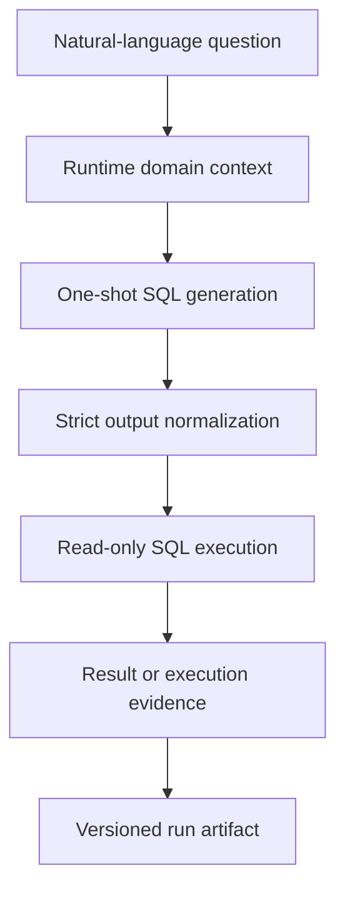
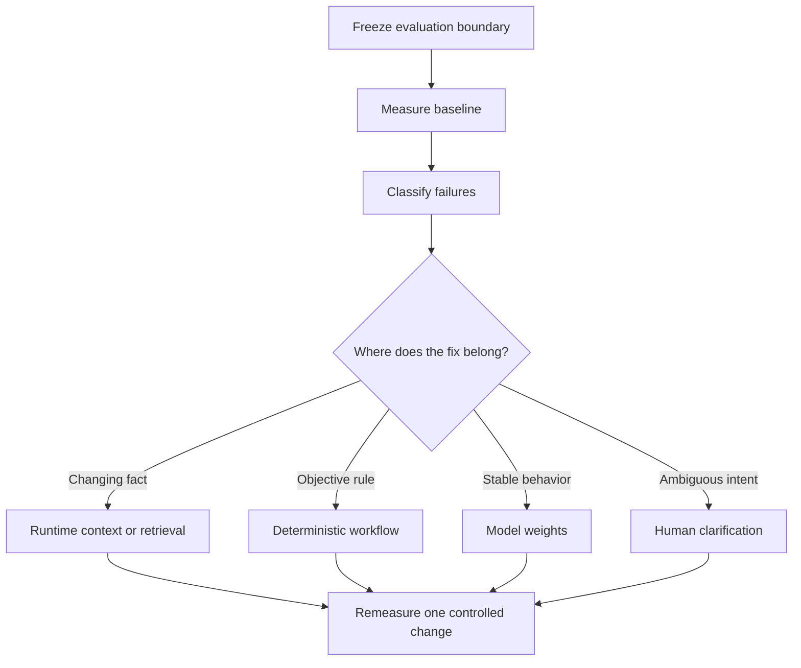
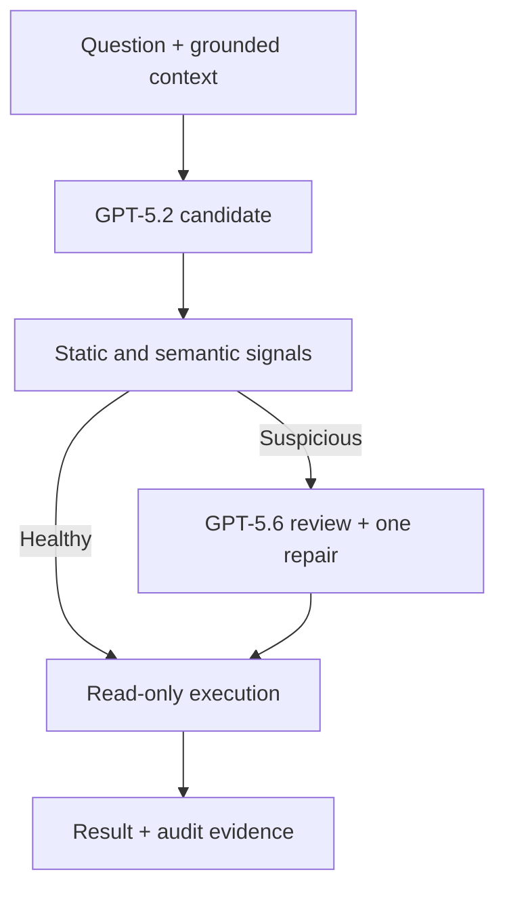

# DomainAdapt Architecture

## V1 measured system

The production candidate remains deliberately small: one model request,
strict normalization, safe execution, deterministic comparison, and versioned
evidence.

The runtime context contains schema-specific facts that should not be memorized
in weights:

- tables, columns, and relationships;
- business meanings;
- exact categorical values;
- units and date formats; and
- concise construction rules.

The artifact records the model/deployment, context hashes, generated SQL,
normalization, execution outcome, task result, usage, latency, and API errors.

## Evaluation and adaptation loop

This routing decision is the core of DomainAdapt. Fine-tuning is one possible
destination, not the default destination.

## Component boundaries

| Layer | Responsibility | V1 example |
|---|---|---|
| Data boundary | Protect evaluation and training independence | Manifest-defined working and fixed sets; financial database excluded from SFT |
| Runtime grounding | Supply current domain facts | Relationship, description, and verified-value context |
| Model | Translate grounded intent into SQL | Ministral-3B, GPT-5.2, or GPT-5.6 Sol |
| Normalizer | Enforce a narrow output envelope | Remove one surrounding SQL fence only |
| Safety/execution | Run candidates without mutation | Read-only SQLite connection and single-statement policy |
| Evaluator | Compare observable behavior | Ordered/unordered result equivalence |
| Evidence store | Preserve causal provenance | Hashed JSON run artifacts |
| Adaptation pipeline | Teach stable behavior when justified | Leakage-safe SFT corpus and Foundry fine-tuning job |

## Recommended next architecture—not yet benchmarked

The strongest V1 system executed 24/24 queries but still made seven semantic
mistakes. The next experiment should therefore target semantic confidence, not
basic syntax recovery.

Candidate signals can include:

- referenced tables and columns exist;
- joins follow declared relationships;
- requested output-column count matches projection count;
- ranking language has an appropriate `ORDER BY` and limit;
- percentage language contains a denominator and safe arithmetic;
- aggregation and grouping are structurally compatible;
- the query is read-only and single-statement; and
- execution returns a plausible shape.

This should be a bounded workflow:

- at most one initial generation;
- at most one conditional review/repair;
- no retry after an incorrect but valid answer merely to improve a benchmark;
- explicit reason codes for every escalation; and
- original and repaired candidates retained for evaluation.

LangGraph could later orchestrate these states, but it is not required to test
the hypothesis. Plain Python functions are easier to inspect and sufficient
until branching, persistence, human handoff, or production observability makes
an orchestration framework valuable.
