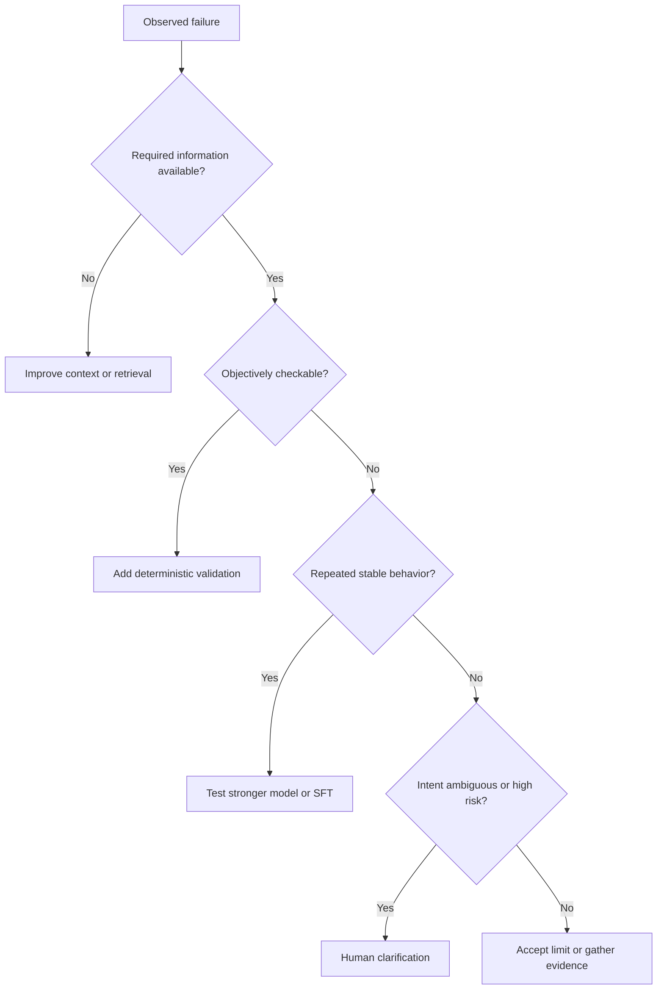

# Reusable Domain-Adaptation Decision Framework

## Purpose

This playbook turns DomainAdapt's Text-to-SQL experiment into a method for
private APIs, CAD automation, healthcare workflows, financial operations,
engineering tools, support systems, and other specialized AI applications.

The governing principle is:

> Do not choose prompting, retrieval, workflow logic, fine-tuning, or agents by
> fashion. Locate the failure, apply the cheapest appropriate intervention,
> and measure one controlled change.

## The intervention ladder

Use the lowest layer that can reliably solve the problem.

| Order | Intervention | Best for | Poor fit for |
|---:|---|---|---|
| 1 | Clear task contract | Output format, scope, safety rules | Missing domain facts |
| 2 | Runtime context or retrieval | Current schemas, APIs, policies, codes | Stable reasoning habits |
| 3 | Deterministic validation | Syntax, types, required fields, safe execution | Subjective semantic intent |
| 4 | Stronger base model | Planning and reasoning capability | Missing/private knowledge |
| 5 | Bounded review and repair | Detectable, recoverable residual mistakes | Unbounded guessing loops |
| 6 | SFT or other adaptation | Repeated, stable, teachable behavior | Changing facts or ambiguous requests |
| 7 | Human clarification | Missing intent, risk, genuine ambiguity | Routine objective checks |

Moving down the ladder adds cost, latency, data requirements, or operational
complexity. Require evidence before doing so.

## Step-by-step method

### 1. Define observable success

Specify what can be measured from the outside:

- correct database result;
- valid API call sequence;
- compiled CAD script;
- correct structured fields;
- policy-compliant recommendation; or
- successful completion of a controlled workflow.

Keep validity separate from correctness. A query can execute and still answer
the wrong question. An API call can return `200` and still produce the wrong
business action.

### 2. Freeze the evidence boundary

Create:

- a working set for repeated diagnosis;
- a final holdout for confirmation;
- explicit source-family exclusions for training and few-shot examples; and
- versioned manifests and hashes.

If the holdout is inspected repeatedly, relabel it honestly as a fixed
benchmark and create a new untouched holdout before making another strong
generalization claim.

### 3. Establish two baselines

Measure:

1. a capable reference model; and
2. the candidate production model.

Use the same context, tools, evaluator, and attempt policy where possible. The
gap tells you whether the challenge is mostly domain information, model
capability, or both.

### 4. Build an evidence-backed failure taxonomy

For each working-set failure, capture:

- request;
- available context;
- produced output;
- expected behavior;
- execution or validator evidence; and
- the first meaningful divergence.

Group by root behavior, not surface error message.

### 5. Route every failure

Ask in order:

1. Is required information missing or changeable? Use runtime context.
2. Can ordinary code verify it objectively? Use deterministic logic.
3. Is it a recurring reasoning weakness? Consider a stronger model or SFT.
4. Could informed people disagree? Ask for clarification.

Do not put customer-specific facts into weights. Do not ask a model to enforce
rules that code can prove.

### 6. Change one major variable

Examples of interpretable ablations:

- minimal schema → relationships added;
- relationships → descriptions added;
- descriptions → verified values added;
- base model → stronger model with context fixed;
- untuned model → tuned model with inference contract fixed.

Avoid changing the model, prompt, retrieval, and retry policy simultaneously.

### 7. Compare transitions, not only scores

Count:

- newly correct;
- retained correct;
- regressed;
- execution recovered but semantically wrong; and
- still wrong.

A one-point gain with zero regressions is more trustworthy than a net one-point
gain produced by several fixes and regressions.

### 8. Add bounded workflow logic only when evidence supports it

A useful repair workflow has:

- an objective or structured escalation signal;
- a strict call budget;
- one clearly defined reviewer or repair responsibility;
- preserved original and repaired outputs; and
- evaluation of the entire workflow, not just the final model call.

An orchestration framework does not create intelligence. It becomes useful
when the validated workflow needs state, branching, persistence, human handoff,
or production telemetry.

### 9. Fine-tune only a falsifiable hypothesis

Fine-tuning is justified when residual failures are:

- **systematic:** they share a root cause;
- **repetitive:** they recur across varied inputs; and
- **teachable:** verified examples demonstrate a stable rule.

Define success before training, including regression limits. Keep the runtime
contract fixed and compare the untuned and tuned versions of the same base
model.

### 10. Promote on a multi-dimensional decision

Accuracy is necessary but not sufficient. Compare:

- task success;
- validity/executability;
- regressions;
- latency;
- token and dollar cost;
- number of model calls;
- deployment footprint;
- observability and failure recovery;
- maintenance and retraining burden; and
- security and data-governance implications.

Reject an intervention when its benefit does not justify its operational cost.
A negative experiment is a successful architectural result when it prevents an
unnecessary production commitment.

## Compact decision tree

## Transfer examples

| Domain | Runtime context | Deterministic workflow | Possible learned behavior |
|---|---|---|---|
| Private APIs | Current OpenAPI specs, versions, auth requirements | Schema validation, type checks, sandbox calls | Dependency-aware call planning |
| CAD/engineering | Current object model, component catalog, constraints | Compile, geometry, collision, and bounds checks | Reusable construction patterns |
| Healthcare | Current patient data, formulary, institutional policy | Range, interaction, provenance, and escalation rules | Stable summarization or coding conventions |
| Finance | Current ledger/schema, product definitions, policy limits | Reconciliation, arithmetic, permissions, audit logging | Repeated analytical transformations |
| Support | Current product docs and account state | Required-field checks, entitlement, action allowlists | Issue classification and resolution sequencing |

## Stop rules

Pause or stop when:

- the evaluation set is too small to support the claim;
- reference labels are unreliable;
- the intervention is being tuned on the final holdout;
- repeated retries hide rather than solve the failure;
- added context increases cost without measured quality gain;
- fine-tuning adds no task-success uplift;
- a simpler model/system combination dominates operationally; or
- the remaining uncertainty requires a person rather than more automation.

## Reusable engagement checklist

- [ ] Define end-to-end task success.
- [ ] Freeze working and holdout sets before optimization.
- [ ] Validate reference labels and runtime assets.
- [ ] Establish capable-model and candidate-model baselines.
- [ ] Separate validity from semantic correctness.
- [ ] Build a root-cause taxonomy from evidence.
- [ ] Route failures to context, code, weights, or humans.
- [ ] Change one major variable per experiment.
- [ ] Record hashes, versions, tokens, latency, and call count.
- [ ] Analyze gains, regressions, and retained successes.
- [ ] Use SFT only for stable teachable behavior.
- [ ] Promote only when benefit exceeds operational complexity.
